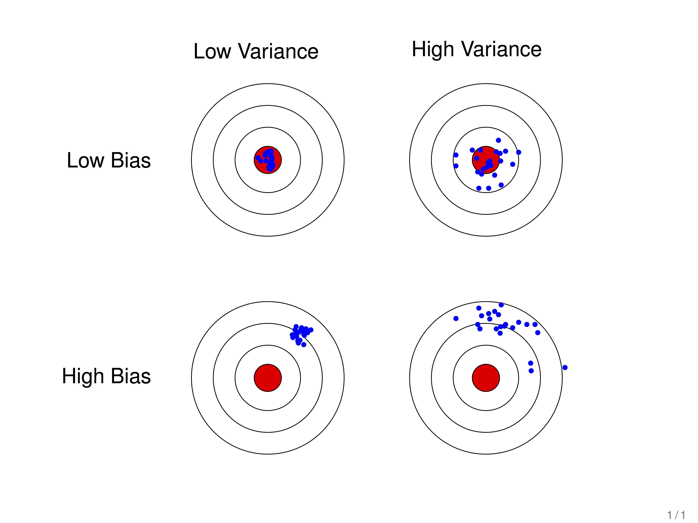

# 任务一：线性回归算法梳理
## 本期学习目标：

1. 机器学习的一些概念 有监督、无监督、泛化能力、过拟合欠拟合(方差和偏差以及各自解决办法)、交叉验证 
2. 线性回归的原理 
3. 线性回归损失函数、代价函数、目标函数 
4. 优化方法(梯度下降法、牛顿法、拟牛顿法等) 
5. 线性回归的评估指标 
6. sklearn参数详解 

<br/>

## 1. 机器学习的一些概念

根据训练数据是否拥有标记信息，学习任务可以大致分为两大类：“监督学习”（supervised learning）和“无监督学习”（unsupervised learning），分类和回归是前者的代表，聚类是后者的代表。
- 有监督学习：学习给定标签的数据集，多为分类和回归。

- 无监督学习：学习没有给定标签的数据集，多为聚类。

- 泛化能力：学得模型适用于新样本的能力，称为“泛化”能力，具有强泛化能力的模型能很好地适用于整个样本空间。

- 过拟合：当学习器把训练样本学得“太好”了的时候，很可能已经把训练样本自身的一些特点当作了所有潜在样本都会具有的一般性质性质，这样就会导致泛化性能下降。这种现象在机器学习中称为“过拟合。

> 过拟合的原因：主要是由模型复杂、维度过量、训练集较小等造成； 该部分没有一个套用的方法，应该根据模型做不断的尝试，努力找到一个各个指标都均衡的模型。

> 过拟合的解决方案：尽量减少选取变量的数量；使用正则化项；进行数据集扩增；训练网络时加dropout；重新清洗数据。

- 欠拟合：与“过拟合”相对，对训练样本的一般性质尚未学好。

> 欠拟合比较容易克服，例如在决策树学习中扩展分支、在神经网络学习中增加训练次数。
过拟合无法彻底避免，只能“缓解”，或者减小风险。

> 欠拟合的解决方案：**添加其他特征项；添加多项式特征；减少正则化参数。

- 偏差：偏差度量了学习算法的期望预测与真实结果的偏离程序，即**刻画了学习算法本身的拟合能力**。

- 方差：方差度量了同样大小的训练集的变动所导致的学习性能的变化，即**刻画了数据扰动所造成的影响**。

  举一个直观的例子，假设红色的靶心区域是学习算法完美的正确预测值，蓝色点为每个数据集所训练出的模型对样本的预测值，当我们从靶心逐渐向外移动时，预测效果逐渐变差。  

  很容易看出有两副图中蓝色点比较集中，另外两幅中比较分散，它们描述的是方差的两种情况。 比较集中的属于方差小的，比较分散的属于方差大的情况。  

  再从蓝色点与红色靶心区域的位置关系，靠近红色靶心的属于偏差较小的情况，远离靶心的属于偏差较大的情况。 
  
  

  一般来说，偏差与方差是有冲突的，称为偏差-方差窘境 (bias-variance dilemma)。

  - 给定一个学习任务，在训练初期，由于训练不足，学习器的拟合能力不够强，偏差比较大，也是由于拟合能力不强，数据集的扰动也无法使学习器产生显著变化，也就是欠拟合的情况；

  - 随着训练程度的加深，学习器的拟合能力逐渐增强，训练数据的扰动也能够渐渐被学习器学到；

  - 充分训练后，学习器的拟合能力已非常强，训练数据的轻微扰动都会导致学习器发生显著变化，当训练数据自身的、非全局的特性被学习器学到了，则将发生过拟合。

- 交叉验证 ：用于模型选择，当实际应用中数据不充分时，为了选择更好的模型，可以采用交叉验证法。其基本思想为：重复的使用数据；把给定的数据进行切分，将切分的数据集组合为训练集和测试集，在此基础上反复进行训练、测试以及模型的选择。

<br/>

## 2. 线性回归的原理 

线性回归是利用数理统计中回归分析，来确定两种或两种以上变量间相互依赖的定量关系的一种统计分析方法，运用十分广泛。其表达形式为y = w'x + e，e为误差，服从均值为0的正态分布。 现在主要的目的就是求得最佳系数w.

> 回归分析中，只包括一个自变量和一个因变量，且二者的关系可用一条直线近似表示，这种回归分析称为一元线性回归分析。如果回归分析中包括两个或两个以上的自变量，且因变量和自变量之间是线性关系，则称为多元线性回归分析。 
> 多元线性仍属于线性回归，许多一元线性的理论仍适用于多元线性；若为非线性关系，模型的创建和优化更加复杂。

<br/>

## 3. 线性回归中的相关函数

- 损失函数
$$
\left(y_i-h(x_i, \beta)\right)^2, \quad \text{for} \quad i = 1, 2, \cdots, n.
$$

- 代价函数
$$
\ell(\mathbf{\beta})=\frac{1}{n}\sum_{i=1}^n\left(y_i-h(x_i, \beta)\right)^2=\frac{1}{n}\left(Y-X\mathbf{\beta}\right)^\top\left(Y-X\mathbf{\beta}\right).
$$

- 目标函数 
$$
\min  \frac{1}{n}\left(Y-X\mathbf{\beta}\right)^\top\left(Y-X\mathbf{\beta}\right)+\lambda||\beta||_p^p.
$$

<br/>

## 4. 优化方法

1. **梯度下降法：** 

    1. 首先对$\theta$赋值，这个值可以是随机的，也可以是一个零向量；

    2. 改变$\theta$的值，使得$J(\theta)$按梯度下降的方向进行减少；

    3. 当$J(\theta)$下降到无法下降时为止，即$J(\theta)$对$\theta$的导数为0时，比较$J(\theta)$的值是否有变化。

2. **牛顿法：**
   无约束条件的最优化问题，假设目标函数$J(\theta)$，$J(\theta)$具有二阶连续偏导数，若第$k$次迭代值为$\theta(k)$，则可将$J(\theta(k+1))$在$\theta(k)$附近进行二阶泰勒展开：
   - J(θ(k+1))=J(θ(k))+J′(θ(k))(θ(k+1)−θ(k))+12J′′(θ(k))(θ(k+1)−θ(k))2

   - J(θ(k+1))=J(θ(k))+J′(θ(k))(θ(k+1)−θ(k))+12J″(θ(k))(θ(k+1)−θ(k))2
     如果 θ(k+1)θ(k+1)趋近于θ(k)θ(k)时，

   - limθ(k+1)−θ(k)→0J(θ(k+1))−J(θ(k))=0limθ(k+1)−θ(k)→0J(θ(k+1))−J(θ(k))=0， 带入上式，可以得到  更新参数集合θθ的迭代公式：

   - θ(k+1)=θ(k)−J′(θ(k))J′′(θ(k))

   - θ(k+1)=θ(k)−J′(θ(k))J″(θ(k))
     其中，J′′(θ(k))J″(θ(k))为J(θ(k))J(θ(k))的海塞矩阵（Hesse Matrix），上式中[J′′(θ(k))]−1[J″(θ(k))]−1即为海塞矩阵的逆矩阵。
  
3. **拟牛顿法：**
   由于牛顿法中海塞矩阵的逆矩阵计算相对复杂，拟牛顿法通过一个nn阶矩阵G(θ(k))G(θ(k))来近似代替[J′′(θ(k))]−1[J″(θ(k))]−1。

   牛顿法中，海塞矩阵需要满足条件：
   - J′(θ(k+1))−J′(θ(k))=J′′(θ(k))(θ(k+1)−θ(k)) 
   - J′(θ(k+1))−J′(θ(k))=J″(θ(k))(θ(k+1)−θ(k)) 
    上式变形，得到拟牛顿条件：
     [J′′(θ(k))]−1(J′(θ(k+1))−J′(θ(k)))=θ(k+1)−θ(k)
     [J″(θ(k))]−1(J′(θ(k+1))−J′(θ(k)))=θ(k+1)−θ(k) 
     拟牛顿法将G(θ(k))G(θ(k))作为[J′′(θ(k))]−1[J″(θ(k))]−1的近似，则G(θ(k))G(θ(k))需要满足如下条件：     
      - 1）每次迭代矩阵G(θ(k))G(θ(k))为正定矩阵；   
      - 2）G(θ(k))G(θ(k))满足拟牛顿条件，即 G(θ(k))(J′(θ(k+1))−J′(θ(k)))=θ(k+1)−θ(k)G(θ(k))(J′(θ(k+1))−J′(θ(k)))=θ(k+1)−θ(k)。

> 该部分的Latex公式的推导暂缓吧。 

<br/>

## 5. 线性回归的评估指标 

- **残差估计：** 
    总体思想是计算实际值与预测值间的差值简称残差。从而实现对回归模型的评估，一般可以画出残差图，进行分析评估、估计模型的异常值、同时还可以检查模型是否是线性的、以及误差是否随机分布
    
- **均方误差(Mean Squared Error, MSE)：**
    均方误差是线性模型拟合过程中，最小化误差平方和(SSE)代价函数的平均值。MSE可以用于不同模型的比较，或是通过网格搜索进行参数调优，以及交叉验证等。
$$
MSE=\frac{1}{n}\sum_{i=1}^n\left(Y_i-\hat Y_i\right)^2.
$$

- **决定系数：** 
    可以看做是MSE的标准化版本，用于更好地解释模型的性能。换句话说，决定系数是模型捕获相应反差的分数。

<br/>

## 6. sklearn参数详解 

```python
LinearRegression(fit_intercept=True, normalize=False, copy_X=True, n_jobs=1)
```

**参数：**  
fit_intercept：布尔型，默认为true  
是否对训练数据进行中心化。如果该变量为false，则表明输入的数据已经进行了中心化，在下面的过程里不进行中心化处理；否则，对输入的训练数据进行中心化处理。

normalize：布尔型，默认为false  
是否对数据进行标准化处理。

copy_X：布尔型，默认为true  
是否对X复制，如果选择false，则直接对原数据进行覆盖。（即经过中心化，标准化后，是否把新数据覆盖到原数据上）。

n_jobs：整型， 默认为1  
计算时设置的任务个数(number of jobs)。如果选择-1则代表使用所有的CPU。这一参数的对于目标个数>1（n_targets>1）且足够大规模的问题有加速作用。

coef_：数组型变量，形状为(n_features, )或(n_targets, n_features)  
说明：对于线性回归问题计算得到的feature的系数。
如果输入的是多目标问题，则返回一个二维数组(n_targets, n_features)；
如果是单目标问题，返回一个一维数组(n_features, )。

intercept_ ：数组型变量  
说明：线性模型中的独立项。

<br/>

## 参考资料

1. 周志华. 机器学习: Machine learning[M]. 北京: 清华大学出版社, 2016.
2. [cs229吴恩达机器学习课程](http://open.163.com/special/opencourse/machinelearning.html)
3. 李航. 统计学习方法[M]. 北京: 清华大学出版社, 2012.
4. https://scikit-learn.org/stable/_downloads/scikit-learn-docs.pdf
5. [详细公式推导](http://t.cn/EJ4F9Q0)

<br/>
