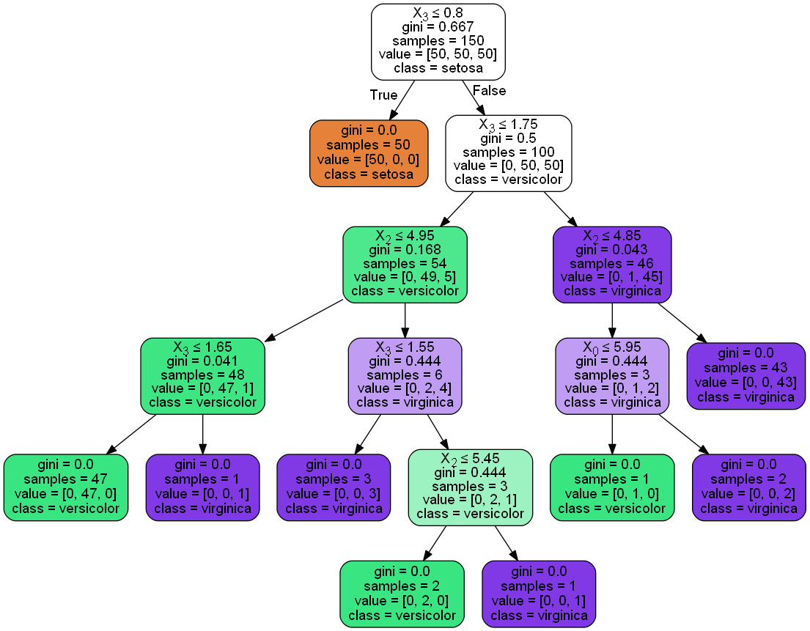

# 任务三：决策树算法梳理

> DATE: 2019.4.1 ~ 2019.4.3

## 本期学习目标：

1. 信息论基础（熵 联合熵 条件熵 信息增益 基尼不纯度）
2. 决策树的不同分类算法（ID3算法、C4.5、CART分类树）的原理及应用场景
3. 回归树原理
4. 决策树防止过拟合手段
5. 模型评估
6. sklearn参数详解，Python绘制决策树

<br/>

## 1. 信息论基础

决策树是通过一系列规则对数据进行分类的过程，他提供一种在什么条件下会得到什么值的类似规则方法，决策树分为分类树和回归树，分类树对离散变量最决策树，回归树对连续变量做决策树

- 熵：衡量信息不确定性的度量指标
传输的平均信息量可以通过求$I(x)=-logp(x)$关于概率分布$p(x)$的期望得到
$$
H(X)=-\displaystyle\sum_{x}p(x)logp(x)=-\sum_{i=1}^{n}p(x_i)logp(x_i)
$$
$H(X)$就被称为随机变量 x 的熵,它是表示随机变量不确定的度量，是对所有可能发生的事件产生的信息量的期望。

- 联合熵：将一维随机变量分布推广到多维随机变量分布，则称其为联合熵 (Joint entropy)：
$$
H(X,Y)=\displaystyle\sum_{x,y}p(x,y)logp(x,y)=\sum_{i=1}^{n}\sum_{j=1}^{m}p(x_i,y_i)logp(x_i,y_i)
$$

- 条件熵：表示在已知随机变量X的条件下随机变量Y的不确定性,相当于联合熵 $H(X,Y)$ 减去单独的熵 $H(X)$: 
$$
H(Y|X) =H(X,Y)-H(X)
$$
描述 X 和 Y 所需的信息是描述X自己所需的信息，加上给定X的条件下具体化Y所需的额外信息。还有[相对熵与交叉熵](https://www.cnblogs.com/kyrieng/p/8694705.html)

- 信息增益：待分类的集合的熵和选定某个特征的条件熵之差（这里只的是经验熵或经验条件熵，由于真正的熵并不知道，是根据样本计算出来的），公式如下：
$$
IG(X|Y)=H(Y)-H(Y|X)
$$

- 基尼不纯度：从一个数据集中随机选取子项，度量其被错误的划分到其他组里的概率。(书上解释)
  一个随机事件变成它的对立事件的概率（简单理解）
$$
I_G(f) = \sum\limits_{i=1}^mf_i(1-f_i) = \sum\limits_{i=1}^m(f_i - f_i^2) = \sum\limits_{i=1}^mf_i - \sum\limits_{i=1}^mf_i^2 = 1 - \sum\limits_{i=1}^mf_i^2
$$

<br/>

## 2. 决策树的不同分类算法的原理及应用场景
ID3算法是采用信息增益来选择分裂属性，c4.5算法采用增益率，CART算法采用Gini指标（分类）或者样本最小方差（回归）;

### 2.1 ID3算法
ID3算法选择具有最高信息增益的自变量作为当前的树叉（树的分支）,分别计算自变量的信息增益，选取其中最大的信息增益作为树叉。算法的核心是在决策树各个结点上应用信息增益准则选择特征，递归地构建决策树。

### 2.2 C4.5算法
C4.5算法与ID3算法相似，C4.5算法对ID3算法进行了改进。C4.5在生成过程中，选择具有最大增益率的属性作为分裂属性。

**相对于ID3算法，C4.5的优点：**
- 1. 用信息增益选择属性时偏向于选择分枝比较多的属性值，即取值多的属性
- 2. 不能处理连贯属性

### 2.3 [CART分类树](https://www.cnblogs.com/yonghao/p/5135386.html)
CART是在给定输入随机变量X条件下输出随机变量Y的条件概率分布的学习方法。

- CART既能是分类树，又能是分类树；
- 当CART是分类树时，采用GINI值作为节点分裂的依据；当CART是回归树时，采用样本的最小方差作为节点分裂的依据；
- CART是一棵二叉树

CART算法由以下两步组成：
1. 决策树生成：基于训练数据集生成决策树，生成的决策树要尽量大；
2. 决策树剪枝：用验证数据集对已生成的树进行剪枝选择最优子树，这时用损失函数最小作为剪枝的标准。

### 2.4 应用场景
用户流失预警、零件坏损预判、ATM机选址等

<br/>

## 3. 回归树原理 
一个回归树对应着输入空间（即特征空间）的一个划分以及在划分单元上的输出值。**分类树**中，采用信息论中的方法，通过计算Gini指数选择最佳划分点。而在**回归树**中，采用的是启发式的方法。假如我们有n个特征，每个特征有si(i∈(1,n))si(i∈(1,n))个取值，那我们遍历所有特征，尝试该特征所有取值，对空间进行划分，直到取到特征j的取值s，使得损失函数最小，这样就得到了一个划分点。描述该过程的公式如下：
$$
min[min Loss(y_i, C_1)+min Loss(y_i, C_2)]
$$
即使用最小剩余方差(Squared Residuals Minimization)来决定Regression Tree的最优划分，该划分准则是期望划分之后的子树误差方差最小。

<br/>

## 4. 决策树防止过拟合手段 
决策树防止过拟合通常是通过剪枝来实现。
可以通过剪枝（预剪枝和后剪枝）控制树的深度和广度，即，选取特征时，控制决策树的参数，即达到一定阈值停止分裂。参数包括：树的深度（几层），叶子节点数，叶节点所含样本数，信息增益等。 

*树的剪枝：树剪枝可以分为先剪枝和后剪枝。*

- 先剪枝：
    通过提前停止树的构造，如通过决定在给定的节点不再分裂或划分训练元组的子集，而对树剪枝，一旦停止，该节点即成为树叶。在构造树时，可以使用诸如统计显著性、信息增益等度量评估分裂的优劣，如果划分一个节点的元组低于预先定义阈值的分裂，则给定子集的进一步划分将停止。但选取一个适当的阈值是困难的，较高的阈值可能导致过分简化的树，而较低的阈值可能使得树的简化太少。

- 后剪枝：
    它由完全生长的树剪去子树，通过删除节点的分支，并用树叶替换它而剪掉给定节点的子树，树叶用被替换的子树中最频繁的类标记。

其中ID3、C4.5使用悲观剪枝方法，CART则为代价复杂度剪枝算法（后剪枝）。

<br/>

## 5. 模型评估 
### 5.1 自助法（bootstrap）：
　　训练集是对于原数据集的有放回抽样，如果原始数据集$N$, 可以证明，大小为$N$的自助样本大约包含原数据63.2%记录。当$N$充分大的时候，$1 - (1 - \frac{1}{N})^N$概率逼近$1-e^{-1}=0.632$。抽样$b$次，产生$b$个bootstrap样本，则总准确率为（$acc_s$为包含所有样本的准确率）：
$$
acc_{boot}=\frac{1}{b}\sum_{i=1}^{b}(0.632\times\varepsilon _{i}+0.368\times acc_{s})
$$

### 5.2 准确度的区间估计：
将分类问题看做二项分布，则有： 
令$X$为模型正确分类，$p$为准确率，$X$服从均值$Np$、方差$Np(1−p)$的二项分布。$acc=XN$为均值$p$，方差$p(1−p)N$的二项分布。$acc$的置信区间：
$$
P\left(-Z_{\frac{\alpha }{2}} \leq \frac{acc-p}{\sqrt{p(1-p)/N}} \leq Z_{1-\frac{\alpha}{2}}\right)=1-\alpha
$$
$$
P\in\frac{2\times N \times acc +Z_{\frac{\alpha}{2}}^{2}\pm Z_{\frac{\alpha}{2}}\sqrt{Z_{\frac{\alpha}{2}}^{2}+4\times N \times acc-4\times N \times acc^{2}}}{2(N+Z_{\frac{\alpha}{2}}^{2})}
$$

<br/>

## 6. sklearn参数详解，Python绘制决策树
- sklearn参数详解
```python
class sklearn.tree.DecisionTreeClassifier(criterion='gini', splitter='best', max_depth=None, min_samples_split=2, min_samples_leaf=1, min_weight_fraction_leaf=0.0, max_features=None, random_state=None, max_leaf_nodes=None, min_impurity_decrease=0.0, min_impurity_split=None, class_weight=None, presort=False)
    参数详解：
　　criterion='gini',string,optional (default=”gini”),衡量分支好坏的标准
　　splitter='best',string, optional (default=”best”),选择分支的策略
　　max_depth=None, int or None, optional (default=None),树的最大深度
　　min_samples_split=2,int,float,optional (default=2),分支时最小样本数
　　min_samples_leaf=1, int, float,optional (default=1),叶子最少样本
　　min_weight_fraction_leaf=0.0,float, optional (default=0.),叶子结点的最小权重
　　max_features=None,int,float,string or None, optional (default=None),生成树时考虑的最多特征点数
　　random_state=None,int, RandomState instance or None, optional (default=None),打乱样本时所用的随机种子
　　max_leaf_nodes=None, int or None, optional (default=None),生成树时采用的最大叶子结点
　　min_impurity_decrease=0.0, float, optional (default=0.),当产生分支时,增加的纯度
　　min_impurity_split=None,float, (default=1e-7),树停止生长的阈值
　　class_weight=None,dict,list of dicts, “balanced” or None, default=None,分支权重预设定
　　presort=False,bool,optional(default=False),提前对数据排序,加快树的生成
```
- Python绘制决策树
```python
from sklearn.datasets import load_iris
from sklearn import tree
from sklearn.tree import export_graphviz

iris = load_iris()
clf = tree.DecisionTreeClassifier()
clf = clf.fit(iris.data, iris.target)

export_graphviz(clf, out_file = "tree.dot", filled = True, rounded = True,class_names = iris.target_names, special_characters = True)
```
得到的决策树为：
 

<br/>

## 参考资料

1. 周志华. 机器学习: Machine learning[M]. 北京: 清华大学出版社, 2016.
2. [cs229吴恩达机器学习课程](http://open.163.com/special/opencourse/machinelearning.html)
3. 李航. 统计学习方法[M]. 北京: 清华大学出版社, 2012.
4. https://scikit-learn.org/stable/_downloads/scikit-learn-docs.pdf
5. [详细公式推导](http://t.cn/EJ4F9Q0)

<br/>